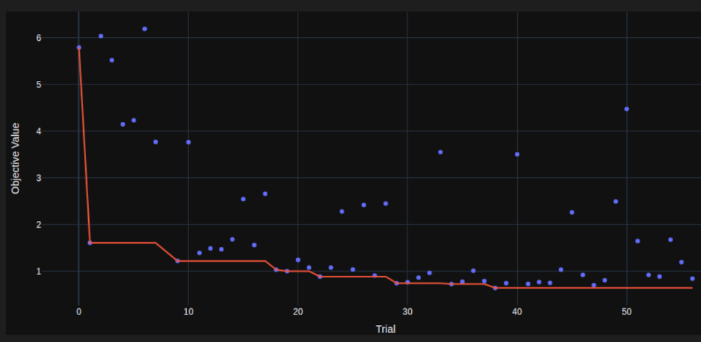

# Unsupervised Deep clustering for Vector Field Analysis 

---

## What is Optuna?

- **Optuna** is an open-source hyperparameter optimization framework.
- It automates the process of tuning parameters for machine learning algorithms.

---

## Key Features

- **Distributed Computing**: Supports distributed optimization across multiple nodes.
- **Flexible**: Compatible with any Python-based machine learning framework.
- **Automatic**: Requires minimal user intervention, automating the parameter search process.
- **Optimization Algorithms**: Offers various algorithms like TPE, Grid Search, Random Search, etc.
- **Visualization**: Provides visualization tools to analyze optimization results.

---

## How does it work?

1. Define the search space.
2. Choose an optimization algorithm.
3. Define the objective function.
4. Run the optimization process.
5. Analyze the results and select the best set of parameters.

---

## Example Code

```python
import optuna

def objective(trial):
    x = trial.suggest_float('x', -10, 10)
    return (x - 2) ** 2

study = optuna.create_study()
study.optimize(objective, n_trials=100)

best_params = study.best_params
best_value = study.best_value

print("Best value:", best_value)
print("Best parameters:", best_params)
```

---

## Visualization



---


---


---


## Use Cases

- **Model Training**: Optimize hyperparameters for machine learning models.
- **Deep Learning**: Tune neural network architectures and learning rates.
- **Feature Selection**: Optimize feature selection parameters.
- **Any Parameter Tuning**: Suitable for any parameter optimization task.

---

## Auto encoder optimization

- number of layers

```python
trial.suggest_int('num_layers', 2, 5)
```

- channels

```python
channels = [input_dim,]
for i in range(num_layers - 1):
    channels.append(trial.suggest_int(f'channels_{i}', 1, 12))
channels.append(output_dim)
```

---

- poolsizes

```python
if num_layers == 2:
        poolsize = trial.suggest_categorical('poolsize_2', [[5, 16], [16, 5],
                                                            [8, 10], [10, 8],
                                                            [4, 20], [20, 4],
                                                            [2, 40], [40, 2]])
    elif num_layers == 3:
        poolsize = trial.suggest_categorical(
            'poolsize_3', [[2, 2, 20], [2, 20, 2], [20, 2, 2],
                           [4, 4, 5], [4, 5, 4], [5, 4, 4],
                           [2, 5, 8], [2, 8, 5], [5, 2, 8],
                           ....
                           ....
```

---

- kernel_sizes

```python
[trial.suggest_int(
        f'kernel_size_{i}', 2, 24) for i in range(num_layers)]
```

- strides

```python
stride=1
```

- dilations

```python
[trial.suggest_int(
        f'dilation_{i}', 1, 5) for i in range(num_layers)]
```

---

- activations

```python
[trial.suggest_categorical(
        f'activation_{i}', ['nn.Softplus',
                            'nn.SELU',
                            'nn.SiLU',
                            'nn.Tanh']) for i in range(num_layers)]
```

- paddings

cpython
"same"
```

- size of latent space (Done manually)

---

## Latent Space


Using, DBSCAN, SS-modified, recon_loss = 0.007! 

---


Using K-means, std_cen, recon_loss = 0.013

---
        Layer (type)               Output Shape         Param #
        Conv2dSame-1           [-1, 11, 80, 80]           2,684
              SELU-2           [-1, 11, 80, 80]               0
         MaxPool2d-3  [[-1, 11, 40, 40], [-1, 11, 40, 40]]               0
        Conv2dSame-4           [-1, 10, 40, 40]          11,010
          Softplus-5           [-1, 10, 40, 40]               0
         MaxPool2d-6  [[-1, 10, 20, 20], [-1, 10, 20, 20]]               0
        Conv2dSame-7           [-1, 12, 20, 20]          20,292
              Tanh-8           [-1, 12, 20, 20]               0
         MaxPool2d-9  [[-1, 12, 10, 10], [-1, 12, 10, 10]]               0
       Conv2dSame-10           [-1, 10, 10, 10]           1,930
         Softplus-11           [-1, 10, 10, 10]               0
        MaxPool2d-12  [[-1, 10, 5, 5], [-1, 10, 5, 5]]               0
       Conv2dSame-13              [-1, 3, 5, 5]           3,633
             Tanh-14              [-1, 3, 5, 5]               0
        MaxPool2d-15  [[-1, 3, 1, 1], [-1, 3, 1, 1]]               0
Total params: 39,549
Trainable params: 39,549
Non-trainable params: 0
----------------------------------------------------------------
Input size (MB): 0.07
Forward/backward pass size (MB): 2495.41
Params size (MB): 0.15
Estimated Total Size (MB): 2495.63
----------------------------------------------------------------
---
# Reconstruction


---

## Curse of Dimensionality

- Stage 1 :
    - num_layers, channels, poolsizes
    - Search space has 
- Stage 2 :
    - activations
    - kernel sizes
    - strides
    - dilations
---

## Clustering optimization

Algorithms : DBSCAN, K-means, Classifier?

## Metrics for clustering

- Silhouette score(SS) modified : Multi-objective optimization where one objective is to maximize the SS and the second is to maximize the number of knife plots that cut through the average SS. 'Cutting' through the average SS means there is atleast one datapoint in each cluster whose SS is greater than the average SS. This ensures that all clusters perform well comparitively and one particularly good cluster does not inflate the SS.

---

- Centroid stand deviation : Minimize the standard deviation of the distance between the centroids of the clusters. This ensures that the centroids are evenly spaced in the latent space.
- KL divergence ?
- Weigted MSE loss


---

## Deep Clustering


---

## PyTorch vs TensorFlow

- Ease of Use : Tensorflow > Pytorch

- Presence on forums : Tensorflow has more presence but PyTorch is used more in relevant projects

- Features : Tensorflow has more

- Tweaking and Experimentation : Easier with Pytorch

---

- Dynamic vs. Static Graphs :
    - PyTorch uses dynamic computation graphs -- the graph is built on-the-fly during runtime. This offers more flexibility for debugging and experimentation.

    - TensorFlow traditionally used static computation graphs(TensorFlow 1.x), where the graph is defined and compiled before execution. TensorFlow 2.x similar to PyTorch

---

## Open Questions

- Latent space dimensionality
- Loss functions - KL divergence, Weighted MSE
- Classifier

## Variational AutoEncoder

- Encoder
```python
        # For VAE: layers to output mean and log variance
        self.fc_mu = nn.Linear(channels[-1], channels[-1])
        self.fc_logvar = nn.Linear(channels[-1], channels[-1])
```

- Decoder : pretty much the same.
---
